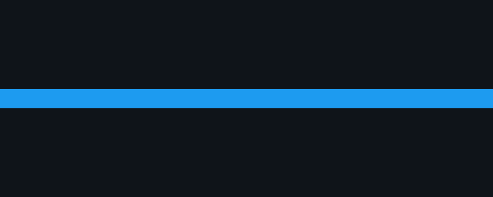
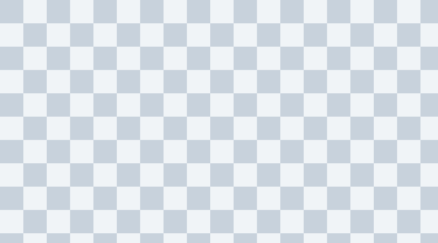
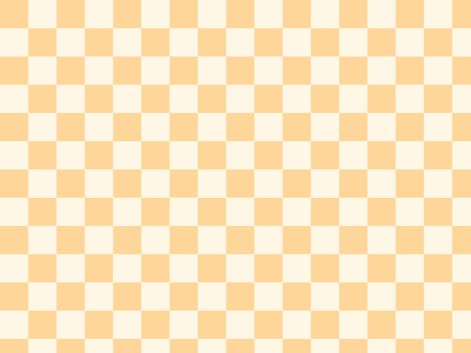
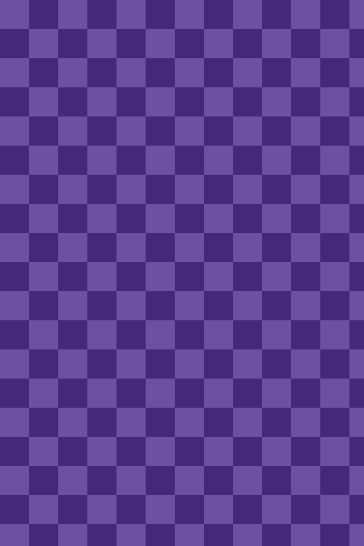

# 이 H1은 frontmatter title이 있어서 버려집니다



이 글은 **X Article MD Import** 확장의 이미지 처리를 시험하기 위한 문서입니다.
`samples/blog-post` 폴더를 통째로 X Article 초안 페이지에 끌어다 놓으세요.
표지 이미지는 본문보다 앞에 있으므로 커버가 되어야 합니다.

## 1. 로컬 이미지

같은 폴더의 PNG 한 장입니다. alt 텍스트가 캡션이 되어야 합니다.



하위 폴더에 있는 PNG입니다. `./` 로 시작하는 상대 경로도 처리됩니다.



세로로 긴 JPEG입니다.



## 2. 외부 이미지

서로 다른 호스트에서 가져옵니다. 확장의 백그라운드 워커가 내려받아 업로드합니다.


## 3. 이미지와 다른 블록 섞기

| 위치 | 이미지 | 기대 결과 |
|---|---|---|
| 커버 | `images/cover.png` | 커버 영역 |
| 본문 | `images/architecture.png` | 미디어 블록 + 캡션 |
| 원격 | `https://picsum.photos/...` | 미디어 블록 + 캡션 |
| 목록 안 | 아래 목록 참고 | `[image: …]` 텍스트로 남음 |

```text
samples/blog-post/
├── post.md
└── images/
    ├── cover.png
    ├── architecture.png
    ├── tall-photo.jpg
    └── screenshots/
        └── settings.png
```

목록 안의 이미지는 블록이 될 수 없어 텍스트로 남습니다.

- 항목 하나 
- 항목 둘

문장 중간의 이미지는  문장 뒤에 별도 블록으로 빠집니다.

## 4. 실패 처리

존재하지 않는 로컬 파일은 업로드하지 못하고 `[image: alt]` 한 줄로 남아야 하며, 완료 토스트에 건너뛴 개수가 표시됩니다.


끝.
